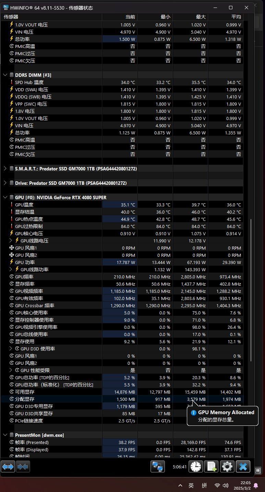

deepseek+OmniParserV2 尝试自动执行任务

闲时写的小玩意（屎山预警），目前看来效果很差

## 环境：

Windows11
CUDA11.8

## 文件内容说明

* `icetools`：自己写的Windows操作工具
* `icon1k`：存放1k屏幕下的模版图像
* `icon2k`：存放2k屏幕下的模版图像
* `imageSendCache`：暂存给deepseek发送的图像
* `logs`：运行时的日志，A开头的图像为原始图像，B开头的图像对应解析后的图像，附带`命令提示符.txt`是视频运行时控制台输出的内容
* `OmniUtil`：官方的工具，自己小改了一下
* `main.py`：主入口
* `environment.yaml`：conda环境
* `template_load.py`：载入模版图像

## 显存占用

